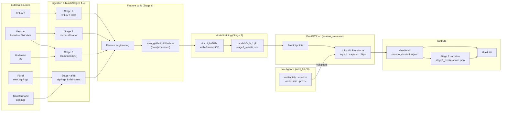

# Data Flow

This note traces how data moves through FPL AI: from raw external sources,
through feature engineering and model training, into the per-gameweek
optimization loop, and out to the narrative layer and UI. For the layered design
see [[system-overview]]; for where files live see [[repository-map]].

## End-to-end pipeline

The system is organized as numbered **stages** (1–9) plus an **intelligence
suite** (intel_01–08) and a **season simulator** that drives the per-gameweek
loop. Stage numbers and their inputs/outputs are documented in
[`CLAUDE.md`](../../CLAUDE.md).

> [!note] Stage 5 was dropped
> Stage 5 (matchup stats) is marked in [`CLAUDE.md`](../../CLAUDE.md) as *"DROPPED —
> matchup stats not enough signal"*. It is intentionally absent from the flow.

## Stages in words

| Stage | Purpose | Main output |
|------|---------|-------------|
| 1 | Fetch current-season FPL API data (players, fixtures, history) | `data/raw/fpl_api/` |
| 2 | Load Vaastav historical gameweek data | `data/raw/vaastav/` |
| 3 | Team form from Vaastav + Understat xG | `data/processed/` |
| 4a / 4b | New-signing (FBref) and debutant previous-league stats | `data/raw/fbref/new_signings/` |
| 6 | Feature engineering → position-split training files | `data/processed/train_*.csv` |
| 7 | Train four LightGBM models, walk-forward CV | `models/xgb_*.pkl`, `stage7_results.json` |
| 8 | ILP squad optimizer (legacy PuLP) | (invoked per GW) |
| 9 | LLM narrative per GW (Claude) | `models/stage9_explanations.json` |

## The per-gameweek loop

During a season the [[season-simulator]] repeats a predict → adjust → optimize →
record → **retrain** cycle for GW1–38, retraining on observed actuals each week
(online retraining, part of [[walkforward-no-leakage]]). The full runtime
sequence — including chips and auto-subs — is documented in the
[[season-simulation]] workflow.

### Intelligence adjustment
Before optimization, predictions are scaled down for players who may not play:
`adjusted_pred = pred × avail_mult × rot_mult`. The exact tier thresholds live in
[[tuned-parameters]]; the signals come from the [[intelligence-suite]]
(`intel_03` availability, `intel_04` rotation risk).

## Leakage discipline

Every feature and split respects strict temporal-integrity rules (GW1 blind test,
no leakage, no cross-season bleed, walk-forward validation). These are why
identifier columns are excluded and validation is never shuffled — the full
rationale is the [[walkforward-no-leakage]] decision.

> [!warning] Uncertainty / data gap
> The stage inputs/outputs above are taken from [`CLAUDE.md`](../../CLAUDE.md) and
> the pipeline file names, not from re-execution — on this clone the raw data is
> absent and the FPL API cannot be re-fetched (see [[environment-and-docker]]).

## Related Source Files

- `pipeline/data_fetcher_stage1.py`, `pipeline/data_loader_stage2.py` — ingestion
- `pipeline/team_form_stage3.py` — team form / xG
- `pipeline/new_signings_stage4a.py`, `pipeline/data_loader_stage4b.py` — signings/debutants
- `pipeline/feature_engineering_stage6.py` — training-file builder
- `pipeline/train_xgboost_stage7.py` — model training
- `pipeline/season_simulator.py` — per-GW loop & online retraining
- `pipeline/intel_03_availability.py`, `pipeline/intel_04_rotation_risk.py` — multiplier inputs
- `pipeline/build_season_inputs.py` — regenerate cross-season inputs
- `data/processed/train_*.csv`, `models/xgb_*.pkl`, `data/intel/season_simulation.json` — key artifacts
