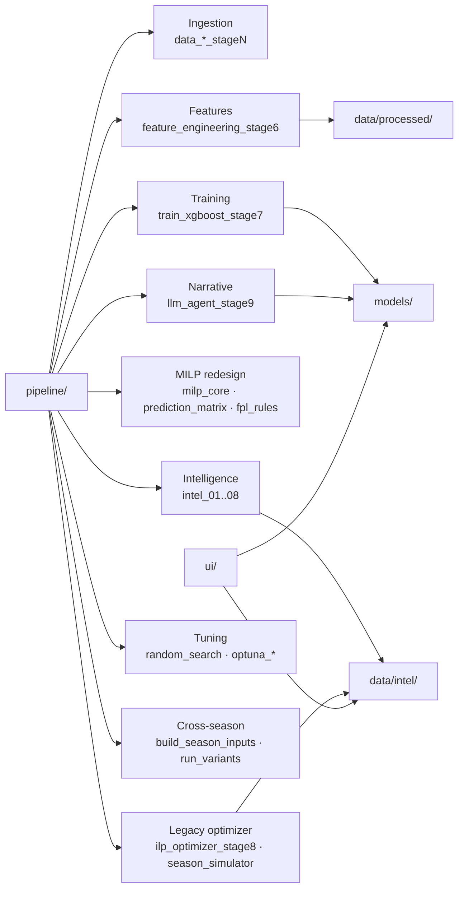

# Repository Map

Where each concern lives in the repository, and which directory to open for a
given task. This is a **navigation aid**, not an inventory of every file — for
what the system does see [[system-overview]], and for how data moves see
[[data-flow]].

## Top-level layout

```
Andrej_dpl_komar_ai/
├── CLAUDE.md              # Operational project memory (authoritative status)
├── AGENTS.md              # ⚠ stale duplicate memory — see caveat below
├── progress.md            # Running progress log
├── pipeline/              # All core pipeline scripts (stages + intel + optimizers)
│   └── archive/           # One-off dev scripts (sweeps, patches, verifiers)
├── models/                # Trained model pickles + stage7/stage9 result JSONs
├── scripts/               # Standalone analysis scripts (reports, sweeps, validators)
├── tests/                 # Plain-python tests (no pytest) for core modules
├── data/
│   ├── raw/               # External source data (GITIGNORED / absent on clones)
│   ├── processed/         # Training files + team form
│   └── intel/             # Live intel outputs + season_simulation.json + search results
├── ui/                    # Flask web UI (server.py + index.html)
├── docs/                  # Design reports + this knowledge base
├── thesis/                # Thesis chapters (MK/EN), figures
└── FINKI_Thesis.pdf       # Compiled thesis
```

## Directory-to-concern map



## `pipeline/` — the core

The bulk of the system. Grouped by role — each group maps to a component note
(names reflect the stages in [[data-flow]]):

- **Ingestion / features** → [[data-pipeline]], [[feature-engineering]]:
  `data_fetcher_stage1`, `data_loader_stage2`, `team_form_stage3`,
  `new_signings_stage4a`, `data_loader_stage4b`, `feature_engineering_stage6`.
- **Model training** → [[prediction-models]]: `train_xgboost_stage7`
  (trains LightGBM despite the name — see [[lightgbm-over-xgboost]]).
- **Optimization — legacy** → [[legacy-ilp-optimizer]], [[season-simulator]]:
  `ilp_optimizer_stage8`, `season_simulator`.
- **Optimization — MILP redesign** → [[milp-optimizer]], [[chip-scheduler]]:
  `milp_core`, `prediction_matrix`, `fpl_rules`, `chip_percentile`,
  `run_variants`, `minutes_model`, `phase1_calibration`, `backtest_metrics`.
- **Intelligence suite** → [[intelligence-suite]]: `intel_01_fpl_live` …
  `intel_08_effective_ownership`, the `intel_02_*` press subsystem, `intel_identity`.
- **Narrative** → [[llm-layers]]: `llm_agent_stage9`.
- **Hyperparameter search** → [[hyperparameter-search]]: `random_search_full`,
  `optuna_search`, `optuna_search_gw38`, `optuna_mp_search`.
- **Cross-season generalization** → [[cross-season-harness]]: `build_season_inputs`.
- `pipeline/archive/` holds superseded one-off scripts.

## `data/` — artifacts

- `data/raw/` — external source data. **Gitignored and absent on this clone**;
  it must be copied from the original machine or rebuilt (see
  [[environment-and-docker]]).
- `data/processed/` — the position-split training files (`train_gk/def/mid/fwd.csv`)
  and team form.
- `data/intel/` — live intel JSONs (`fpl_live`, `availability`, `rotation_risk`,
  `recommendations`, `effective_ownership`, …), the headline
  `season_simulation.json`, per-config corrected/mp outputs, and hyperparameter
  search results (`random_search_full/`, `optuna_search/`, `optuna_search_gw38/`,
  `optuna_mp/`). Milestone runs are archived under `data/intel/archive/`.

## `models/`, `scripts/`, `tests/`, `ui/`

- **`models/`** — trained pickles (`xgb_gk/def/mid/fwd.pkl` — LightGBM inside),
  `stage7_results.json` (hyperparams + MAE), `stage8_*` backtests, and
  `stage9_explanations.json` (Claude narrative).
- **`scripts/`** — standalone analysis: bench reports, form/FDR sweeps, and the
  scraper validator. Not part of the production loop.
- **`tests/`** — plain-python test files (run directly, not via pytest) covering
  the MILP core/chips/horizon, FPL rules, prediction matrix, minutes model,
  chip percentile, and the intel_02/intel_08 subsystems.
- **`ui/`** — `server.py` (Flask) reads `data/intel/season_simulation.json` and
  `models/stage9_explanations.json` (plus availability/rotation JSONs) and serves
  `index.html`.

## `docs/` — reports + this knowledge base

The design reports predate this vault and remain the **evidence layer**:
[[HANDOFF]] (single source of truth for the optimizer redesign),
[[optimizer_redesign]], [[phase0_baseline]] through the phase reports,
[[chip_strategy_redesign]], [[generalization_report]], [[recommendation_layer]],
and [[press_scraper_redesign]]. Conceptual notes link to these rather than
duplicating them.

> [!warning] Two memory files
> Both `CLAUDE.md` and `AGENTS.md` sit in the repository root and largely
> duplicate each other, but **`AGENTS.md` is out of date** (references "Codex", a
> 1799-pt GW1–28 best, and omits the optimizer redesign and `intel_08`). Treat
> `CLAUDE.md` and [[HANDOFF]] as authoritative.

## Related Source Files

- `pipeline/` — all core scripts (see grouping above)
- `models/stage7_results.json`, `models/stage9_explanations.json` — result artifacts
- `scripts/validate_scraper_v2.py` — example standalone analysis script
- `tests/` — module tests (e.g. `test_milp_core.py`, `test_fpl_rules.py`)
- `ui/server.py`, `ui/index.html` — web UI
- `data/processed/`, `data/intel/` — pipeline artifacts
