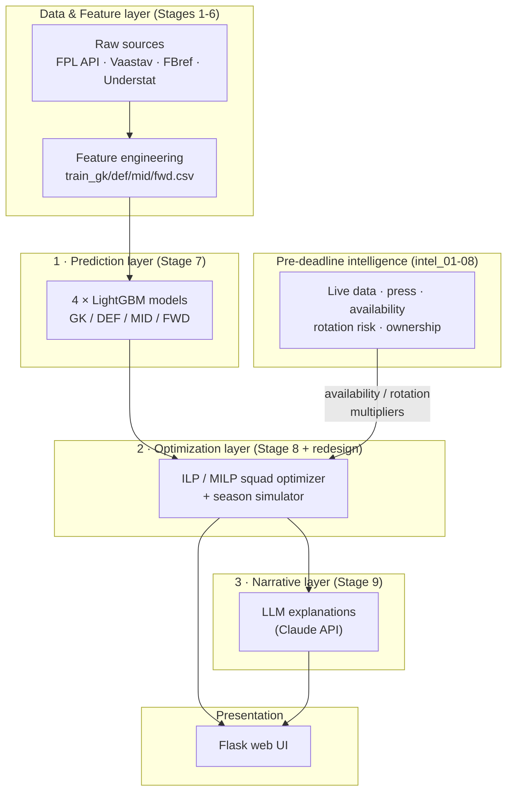
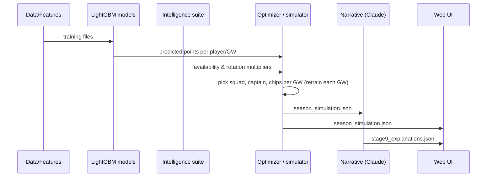

# System Overview

FPL AI is a **hybrid AI system** that manages a Fantasy Premier League team over
a full 38-gameweek season. It combines statistical prediction, mathematical
optimization, and an LLM narrative layer, with a pre-deadline intelligence suite
that adjusts decisions using live real-world signals.

This note is the central hub of the knowledge base. For how data moves through
the system see [[data-flow]]; for where each part lives see [[repository-map]].

## The layered design

The system is described in [`CLAUDE.md`](../../CLAUDE.md) as a *"3-layer hybrid
AI: LightGBM models → ILP optimizer → LLM agent"*, plus an intelligence suite
and a UI.

## The layers

### Data & feature layer (Stages 1–6)
Ingests historical and current-season data from multiple external sources and
produces four position-split training files (~51k rows total). Stage 5 (matchup
stats) was dropped as insufficient signal. Detailed sequence in [[data-flow]].

### 1 · Prediction layer (Stage 7)
Four **separate LightGBM regressors**, one per position, predict each player's
`total_points`. They are trained with **walk-forward cross-validation** across
six seasons so no future information leaks into a prediction. Keeping models
per-position and preserving temporal order are two of the project's
[non-negotiable rules](../../CLAUDE.md). XGBoost was evaluated and rejected
(LightGBM dominated the hyperparameter search).

### 2 · Optimization layer (Stage 8 + redesign)
Turns predicted points into concrete decisions — squad, starting XI, captain,
transfers, and chip timing — under FPL's budget and squad-composition rules.

There are **two coexisting implementations**:

- **Legacy (production):** an ILP built on **PuLP** (`ilp_optimizer_stage8.py`),
  wrapped by `season_simulator.py` with a set of hand/Optuna-tuned constants.
  This produced the headline full-season results.
- **Redesign (in progress):** a **multi-period MILP** (`milp_core.py`,
  `prediction_matrix.py`, `fpl_rules.py`) using the HiGHS solver, selected via an
  `OPTIMIZER=mp` environment flag. Its status is tracked through Phases 0–6 in
  [[HANDOFF]] and the `phase*_report.md` documents.

### Pre-deadline intelligence (intel_01–08)
A suite that gathers real-world signals before each deadline — injuries, prices,
ownership, press-conference news, availability, and rotation risk — and feeds
**availability/rotation multipliers** into the optimizer to down-weight players
who are unlikely to play. It also produces LLM-based recommendations (via the
Gemini API in `intel_05`). See the design report [[recommendation_layer]].

### 3 · Narrative layer (Stage 9)
A **post-hoc explanatory layer**: after a season is simulated, an LLM (Claude
API) generates a per-gameweek narrative explaining why players were picked. It
is **explanatory only** — it makes no decisions.

### Presentation
A small **Flask** web UI reads the simulation output and narratives and renders
the season.

## How the layers interact

The optimizer is the **integration point**: predictions and intelligence signals
converge there, and its output feeds both the narrative layer and the UI.

## Key results (context)

The full GW1–38 season scored **2468 pts** (~64.9/GW), roughly +400 over an
average manager — but that figure is environment-bound (Docker reproduces 2236;
2252 is the fair baseline). Numbers and their caveats live in
[[evaluation-metrics-and-results]] and [[environment-and-docker]].

## Where to go next
- **Run it:** [[season-simulation]] is the end-to-end process that realizes this
  architecture; [[data-flow]] shows the static pipeline.
- **Subsystems:** [[prediction-models]], the optimizers ([[legacy-ilp-optimizer]]
  / [[milp-optimizer]]), [[season-simulator]], [[intelligence-suite]],
  [[llm-layers]].
- **Why it's built this way:** [[optimizer-redesign]], [[walkforward-no-leakage]],
  [[four-position-models]], and the other [[known-limitations|decisions]].

> [!warning] Uncertainty
> The prediction → optimization → narrative decomposition and the intel
> multipliers are confirmed by [`CLAUDE.md`](../../CLAUDE.md) and the code
> layout. Exact runtime behavior of individual scripts was not verified
> line-by-line for this overview; component notes (Phase 2) will document each
> subsystem precisely.

## Related Source Files

- `pipeline/feature_engineering_stage6.py` — feature/training-file builder
- `pipeline/train_xgboost_stage7.py` — trains the four LightGBM models
- `pipeline/ilp_optimizer_stage8.py` — legacy PuLP optimizer
- `pipeline/season_simulator.py` — full-season driver / production optimizer wrapper
- `pipeline/milp_core.py`, `pipeline/prediction_matrix.py`, `pipeline/fpl_rules.py` — MILP redesign core
- `pipeline/intel_01_fpl_live.py` … `pipeline/intel_08_effective_ownership.py` — intelligence suite
- `pipeline/llm_agent_stage9.py` — Claude narrative layer
- `ui/server.py`, `ui/index.html` — Flask web UI
