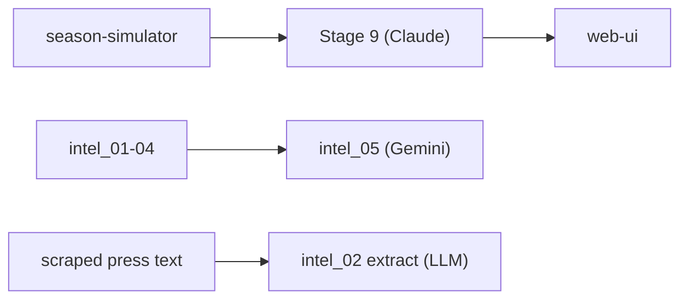

# LLM Layers

Where large language models are used in the project. This note collects **all**
LLM usage in one place so it isn't scattered per-script; the models never make
squad decisions — they explain, recommend, or extract.

## Responsibility
Three distinct LLM uses:
1. **Stage 9 narrative (Claude API)** — after a season is simulated, generate a
   per-gameweek explanation of why each player was picked. Read-only over
   `season_simulation.json`; one call per GW. Code constants: `MODEL_ID =
   "claude-sonnet-4-6"`, `MAX_TOKENS = 2500`, `TEMPERATURE = 0`.
2. **`intel_05` recommendations (Gemini 2.5 Flash)** — per-GW captain,
   differential, transfer, and risk suggestions built from `intel_01`–`intel_04`.
3. **`intel_02` press extraction (LLM)** — structured extraction of injury/rotation
   news from scraped press text.

## Why it exists
The thesis needs an explainability layer (Stage 9) that translates opaque
optimizer decisions into human narrative, and the intelligence suite benefits
from LLMs for the two tasks classical code does poorly: free-text news
extraction and holistic recommendation. Keeping decisions out of the LLM
preserves reproducibility.

## How it interacts
Stage 9 sits **downstream** of the [[season-simulator]] and feeds the
[[web-ui]]. The `intel_05`/`intel_02` uses are functionally part of the
[[intelligence-suite]] and are documented there as pipeline stages; this note is
the cross-cutting "LLM view." API keys are loaded from a project `.env`.

## Depends on
- [[season-simulator]] (Stage 9 input).
- [[intelligence-suite]] (`intel_05` inputs; `intel_02` scraped text).
- External APIs: Claude (Anthropic) and Gemini (Google).

## Depended on by
- [[web-ui]] (serves Stage 9 explanations).

## Assumptions & limitations
- Requires valid API keys in `.env`; without them these layers cannot run.
- Stage 9 is **explanatory only** — it reads results and never alters decisions.
- [`CLAUDE.md`](../../CLAUDE.md) lists an older Stage 9 model id/token budget; the
  values above are taken from the current `llm_agent_stage9.py` source and should
  be treated as authoritative.

## Related Source Files
- `pipeline/llm_agent_stage9.py`
- `pipeline/intel_05_recommendations.py`
- `pipeline/intel_02_llm_extract.py`
- `models/stage9_explanations.json`, `data/intel/recommendations.json`

---
Hubs: [[system-overview]] · [[data-flow]] · [[repository-map]]
