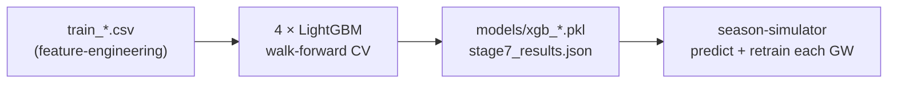

# Prediction Models

The statistical core: four **LightGBM** regressors, one per position, that
predict each player's `total_points` for an upcoming gameweek. This is
**Stage 7** in [[data-flow]] and layer 1 of [[system-overview]].

## Responsibility
Train and serve four independent models (GK / DEF / MID / FWD) using
**walk-forward cross-validation** across six seasons, then predict points that
the optimizer consumes.

## Why it exists
Player scoring dynamics differ sharply by position (clean sheets and saves for
defenders/keepers, goals/assists for attackers), so one model per position
outperforms a shared model ([[four-position-models]]). LightGBM was chosen after a
search in which it dominated XGBoost ([[lightgbm-over-xgboost]]).

## How it interacts
Reads the training files from [[feature-engineering]] and produces per-player
predictions consumed by [[legacy-ilp-optimizer]], [[milp-optimizer]], and the
[[season-simulator]]. During a season run the [[season-simulator]] **retrains
these models every gameweek** with observed actuals appended (online retraining).
Both the batch fit and this per-GW retrain are the [[model-training]] workflow.

## Depends on
- [[feature-engineering]] (training files, canonical feature order).

## Depended on by
- [[legacy-ilp-optimizer]] and [[milp-optimizer]] (predicted points).
- [[season-simulator]] (predict + per-GW retrain).
- [[hyperparameter-search]] (tunes model hyperparameters against the season objective).

## Assumptions & limitations
- **Walk-forward, no leakage, GW1 blind** — the temporal-integrity rules
  (recency fold-weights `[1, 1.5, 2, 2.5, 3]`, never shuffled) are defined in
  [[walkforward-no-leakage]].
- Pickle filenames are `xgb_*.pkl` for historical reasons but contain **LightGBM**
  models when `MODEL_TYPE="lgbm"` (the production setting).
- Primary metric is MAE; secondary is top-N accuracy.

## Related Source Files
- `pipeline/train_xgboost_stage7.py`
- `models/xgb_gk.pkl`, `xgb_def.pkl`, `xgb_mid.pkl`, `xgb_fwd.pkl`
- `models/stage7_results.json`

---
Hubs: [[system-overview]] · [[data-flow]] · [[repository-map]]
