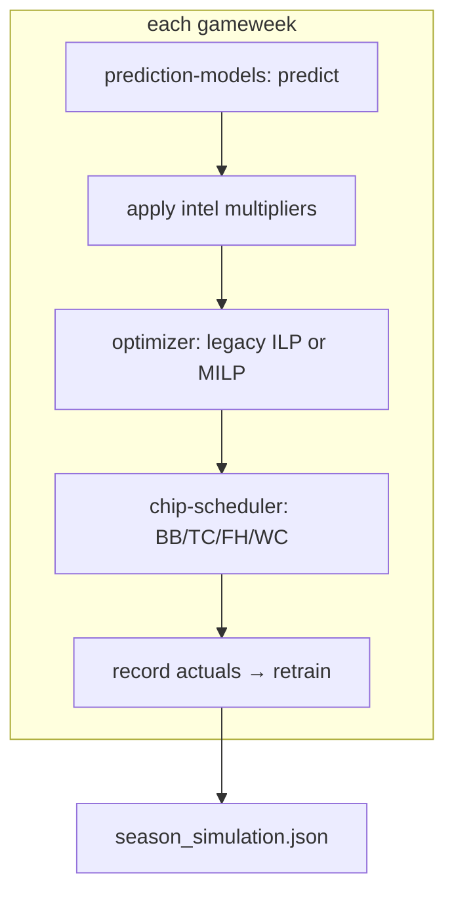

# Season Simulator

The orchestrator that runs a full FPL season gameweek by gameweek. It is where
predictions, intelligence, chips, and the optimizer converge — the central
runtime hub of the system (see [[system-overview]]).

## Responsibility
Drive GW1→38: for each gameweek predict points, apply intelligence multipliers,
optimize the squad/captain/transfers/chips, record the actual score, then
**retrain the models with actuals appended** before advancing (online
retraining). Its production output is `data/intel/season_simulation.json`. The
end-to-end run is documented as the [[season-simulation]] workflow.

## Why it exists
The other components each solve one slice (predict, optimize, gather intel). The
simulator sequences them into a realistic season under FPL's temporal rules —
including free-transfer banking, transfer-hit penalties, auto-subs, and chip
timing — and is the object every tuning and generalization run optimizes against.

## How it interacts

Key environment flags select behavior: `MODEL_TYPE` (lgbm), `OPTIMIZER`
(`legacy` default | `mp`), `RULES_MODE` (`legacy` | `corrected`), `CHIP_STRATEGY`
(`v2` | `legacy`), and `SIM_SEASON`/`SIM_END_GW` for cross-season runs.

## Depends on
- [[prediction-models]] (predict + per-GW retrain).
- [[legacy-ilp-optimizer]] **or** [[milp-optimizer]] (chosen by `OPTIMIZER`).
- [[intelligence-suite]] (availability/rotation multipliers on predictions).
- [[chip-scheduler]] (chip timing).

## Depended on by
- [[llm-layers]] (Stage 9 reads its output).
- [[web-ui]] (renders its output; can trigger a run).
- [[hyperparameter-search]] (patches and runs it as the objective).
- [[cross-season-harness]] (runs it on rebuilt neutral seasons).

## Assumptions & limitations
- **The headline score is environment-bound** — see [[environment-and-docker]]
  and [[evaluation-metrics-and-results]].
- The tuned-constant configuration (FDR, loyalty, captain gates, penalty formula)
  is the legacy path, catalogued in [[tuned-parameters]] and being replaced by the
  [[milp-optimizer]] ([[optimizer-redesign]]).
- Does not use `intel_03` availability directly for transfer decisions — an
  accepted [[known-limitations|limitation]].

## Related Source Files
- `pipeline/season_simulator.py`
- `pipeline/intel_06_optimizer.py` (intel-injected variant, GW1–10 log → `final_squad.json`)
- `data/intel/season_simulation.json`

---
Hubs: [[system-overview]] · [[data-flow]] · [[repository-map]]
