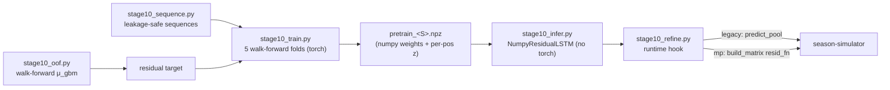

# Stage 10 — LSTM Residual Layer

A stacked correction layer between the [[prediction-models|LightGBM predictions]]
and the optimizer. It reads each player's gameweek **sequence** and emits an
additive correction to the raw model μ plus a calibrated captaincy ceiling
(`q90`). **Phase 1** (LSTM only) is complete and shipped for the
[[milp-optimizer]]; a GNN layer is planned for Phase 2.

## Responsibility

For a target gameweek, correct the raw per-player GBM μ using temporal state the
reset-every-season rolling features miss (form momentum, fixture runs,
post-absence ramps), and produce a per-position-calibrated `q90` for the captain
channel.

```
LightGBM μ  →  LSTM(μ, sequence 1..t-1)  →  (r̂, σ)
                         r_applied = confidence_gate(r̂)          added to μ
                         q90       = μ + r_applied + z·σ_eff     captain ceiling
```

## Why it exists

The GBM is unbiased in the mean but **cannot spike** — 16 % of rows are missed
hauls carrying 40 % of the residual error mass, 2:1 skewed toward
under-prediction. The rolling player features are within-current-season only, so
the model has no notion of trajectory. The LSTM recovers the fraction of the
upside tail that temporal state explains, and its variance head fixes the q90
under-coverage the [[milp-optimizer]]'s empirical-headroom estimate had (0.836 →
0.89).

## How it interacts



Selected by the **`STAGE10=off|on`** env flag (default `off`). `off` is a true
no-op — `stage10_refine` is never imported, so **torch never loads**, and
`predict_pool` / `build_matrix` take the exact pre-flag code path (byte-identical,
[[stage10-residual-lstm|gate 1]]). `on` writes a separate `*_s10.json`.

- **Legacy path** — raw μ stashed → `refine()` returns `{pid: r_applied}` → μ+r
  re-run through the same `_finalize` (FDR/intel stay downstream). `stage10_q90`
  blended into `select_captain` (`CAP_Q90_W`, the `kappa` analogue).
- **mp path** — `build_matrix(resid_fn=…)` adds r to the post-FDR summed μ and
  overrides the headroom `q90` with the calibrated value → straight into the
  MILP objective (`kappa = π·[(1−θ)μ + θ·q90]`). Since fix 6 the shipped
  `MP_THETA=0`, so `kappa = π·μ` (pure EV) and the calibrated q90 is currently
  unused by the mp captain channel — kept for the legacy captain and Phase 2.

## Depends on

- [[prediction-models]] — the raw μ it corrects (via `stage10_oof.py` offline and
  `raw_mu_history` at runtime).
- [[feature-engineering]] — `base_gw_table.csv` and the canonical `FEAT_COLS`
  order (imported from `prediction_matrix.DEFAULT_FEAT_COLS`).
- PyTorch — **training only** (`stage10_train.py`, `stage10_finetune.py`).
  Runtime inference is a dependency-free numpy forward pass.

## Depended on by

- [[season-simulator]] — the `STAGE10=on` prediction path.
- [[milp-optimizer]] — the recommended consumer (`kappa` uses the calibrated
  q90; the mp path is where Phase 1 nets positive).

## Assumptions & limitations

- **Shipped for `OPTIMIZER=mp MP_THETA=0`.** Definitive 15-run A/B (`STAGE10`
  off → on, all fixes): mp **+28 / +56 / +81** across 2023-24 / 2024-25 / 2025-26
  (**mean +55/season** — LSTM residual ~+28, pure-EV captain objective ~+27,
  additive); legacy −53 / 0 / +19 (mean −11, inconsistent, one real regression).
  Full matrix, decomposition, and ruled-out fixes 3/4/5 in
  [[stage10_phase1_report]].
- **In-season fine-tune is disabled** — measured to hurt holdout MAE (the head
  overfits the thin partial-season sample). `STAGE10_FT=on` to experiment.
- **Runtime sequence approximations** — `o_gc` timestep → 0, slow features held
  at the current GW (2 of 56 features). `o_bps` was also 0 until fix 2 closed
  that train/serve gap. Documented in `stage10_refine.py`.
- **Determinism** — the `STAGE10=on` runtime is numpy-only and fully
  deterministic. Training carries a small cross-machine tolerance band; the
  shipped artifact is the frozen `.npz`.
- Temporal-integrity rules ([[walkforward-no-leakage]]) hold: sequences truncate
  at kickoff, folds partition by season, GW1 is a no-op.

## Related Source Files

- `pipeline/stage10_oof.py`, `stage10_sequence.py`, `stage10_model.py`,
  `stage10_train.py`, `stage10_infer.py`, `stage10_refine.py`, `stage10_finetune.py`
- `tests/test_stage10_sequence.py`, `test_stage10_identity.py`, `test_stage10_shapes.py`
- `models/stage10/` — `oof_preds.csv`, `pretrain_<S>.{pt,npz}`,
  `stage10_config.json`, `stage10_calibration.json`, `stage10_finetune.json`
- `docs/stage10_phase1_plan.md`, `docs/stage10_phase1_report.md`

---
Hubs: [[system-overview]] · [[data-flow]] · [[repository-map]]
