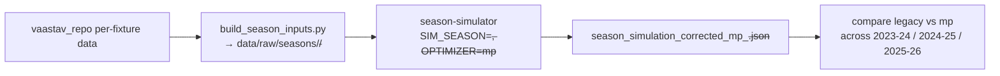

# Workflow: Cross-Season Generalization

How the system is replayed on **past, unseen seasons** to prove it generalizes
rather than memorizing the 2025-26 calendar — the thesis-critical evaluation.
This is the process view of the [[cross-season-harness]] component.

## Trigger
A validation run, started manually in Docker, whenever a redesign change needs to
be shown to travel (e.g. after an [[milp-optimizer]] phase lands).

## Major stages

## Components involved
[[cross-season-harness]] (input rebuild + `SIM_SEASON` handling),
[[season-simulator]] (the run), and [[milp-optimizer]] (the config under test),
compared against the [[legacy-ilp-optimizer]] baseline.

## Inputs
A Vaastav repo clone (`data/raw/vaastav_repo/`) providing true per-fixture data
for 2023-24 and 2024-25.

## Outputs
Per-season corrected/mp simulation JSONs and the comparison written up in
[[generalization_report]]; the running scoreboard is maintained in [[HANDOFF]].

## Assumptions & constraints
- Corrected rules only, intel off — neutral seasons isolate optimizer
  generalization, not the full production stack.
- Input rebuild encodes deliberate schema choices (GW1 price from history, an
  `element_type=5` AM filter for 2024-25) — see [[cross-season-harness]] and
  [[fixing_backlog]].
- Docker-only; neutral results are not comparable to the environment-bound 2468.

## How it can fail
- Missing `vaastav_repo` data on this clone (must be re-fetched).
- Schema drift between the rebuilt inputs and what the simulator expects.
- Reading the headline claim without its caveat: legacy's home-season edge is
  largely memorized calendar, which the neutral runs exist to expose.

## Related Source Files
- `pipeline/build_season_inputs.py`
- `pipeline/season_simulator.py` (`SIM_SEASON` / `SIM_END_GW` handling)

---
Hubs: [[system-overview]] · [[data-flow]]
