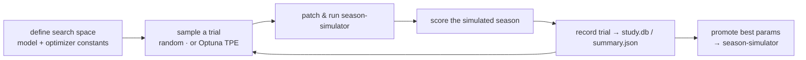

# Workflow: Hyperparameter Tuning

How the model and strategy constants that drive [[season-simulation]] are
searched offline. This is the process view of the [[hyperparameter-search]]
component.

## Trigger
A research/optimization run, started manually (in Docker). Not part of any live
pipeline — it exists to *find* the parameters the production run later uses.

## Major stages

Random search (250 trials) explores broadly; Optuna (TPE) refines, warm-started
from the best random trial, at several scopes (GW1–28, full GW1–38, and an
`optuna_mp` search for the [[milp-optimizer]] config).

## Components involved
[[hyperparameter-search]] (the driver), [[season-simulator]] (the objective, run
once per trial via the same patch mechanism as `run_variants.py`), and
[[prediction-models]] (model hyperparameters are part of the space).

## Inputs
The same season inputs as [[season-simulation]], plus a defined parameter space.

## Outputs
Per-study `summary.json`, `study.db`, and `trial_*.json` under
`data/intel/optuna_search*/` and `random_search_full/`; the winning parameters are
copied into the [[season-simulator]] (recorded as "current params" in
[`CLAUDE.md`](../../CLAUDE.md)).

## Assumptions & constraints
- Results are **environment-sensitive** — trials are only comparable within one
  library stack and one scope (see [[environment-and-docker]]).
- A full-season trial is expensive; searches run for hundreds of trials over long
  wall-clock periods.

## How it can fail
- Comparing trials across scopes (GW1–28 vs GW1–38) or environments yields
  misleading rankings.
- Running competing simulations while a sweep is live corrupts shared output
  files — milestone runs must be archived first ([[HANDOFF]]).

## Related Source Files
- `pipeline/random_search_full.py`
- `pipeline/optuna_search.py`, `optuna_search_gw38.py`, `optuna_mp_search.py`
- `pipeline/run_variants.py`

---
Hubs: [[system-overview]] · [[data-flow]]
