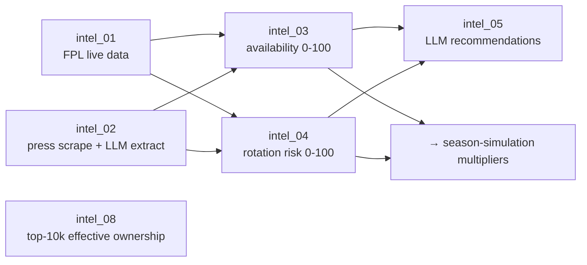

# Workflow: Intelligence Gathering

How real-world, pre-deadline signals are collected and turned into the
availability/rotation multipliers the [[season-simulation]] applies. This is the
process view of the [[intelligence-suite]] component.

## Trigger
Run before a gameweek deadline (the intel stages are per-GW). In a live setting
each stage runs in sequence as new information becomes available; the
[`CLAUDE.md`](../../CLAUDE.md) press-scraper design escalates effort as the
deadline approaches (T-24h).

## Major stages

`intel_03` merges 65% press + 35% FPL (+5 if both agree); `intel_04` scores
rotation from start rate, minutes volatility, bench rate, recent trend, and press
keywords.

## Components involved
[[intelligence-suite]] (all stages) and [[llm-layers]] (`intel_05` recommendations
via Gemini; `intel_02` press extraction via an LLM).

## Inputs
The FPL API (`intel_01`), press sites — Fantasy Football Scout and Tier 3/4
sources (`intel_02`), and the LiveFPL top-10k feed (`intel_08`).

## Outputs
`data/intel/{fpl_live,availability,rotation_risk,recommendations,effective_ownership}.json`
plus the per-GW EO archive `data/intel/eo_history/gw{N}.json`. The availability
and rotation files are what the [[season-simulator]] and [[web-ui]] read.

## Assumptions & constraints
- LLM stages require API keys in `.env`.
- `intel_08` EO is forward-only — it **cannot be backfilled**.

## How it can fail
- **Press-scraper popularity bias** — clubs absent from article headers (the
  documented Newcastle case) have injuries missed; a cross-club fallback was
  reverted for causing costly cascading transfers. See [[known-limitations]]
  (design context: [[press_scraper_redesign]]).
- Source site markup changes break scraping; missing API keys disable `intel_05`.
- Because the [[season-simulator]] does not use `intel_03` directly for transfer
  decisions, an undetected injury can persist in the squad.

## Related Source Files
- `pipeline/intel_01_fpl_live.py` … `pipeline/intel_08_effective_ownership.py`
- `pipeline/intel_02_scrape.py`, `intel_02_llm_extract.py`, `intel_02_sources.py`
- `data/intel/availability.json`, `rotation_risk.json`

---
Hubs: [[system-overview]] · [[data-flow]]
