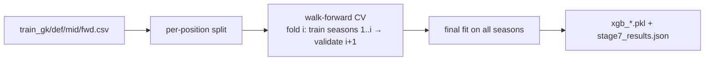

# Workflow: Model Training

How the four prediction models are produced and kept current. Bridges the
[[data-flow]] pipeline to the [[prediction-models]] component.

## Trigger
Two distinct triggers:
- **Offline (batch):** run the trainer once against the prepared training files
  (before a season run, or after a feature or hyperparameter change).
- **Online (in-loop):** the [[season-simulator]] retrains every gameweek during a
  season run, appending the just-observed actuals — a full retrain, not
  incremental (a hard rule in [`CLAUDE.md`](../../CLAUDE.md)).

## Major stages

Folds are recency-weighted `[1, 1.5, 2, 2.5, 3]`; order is never shuffled.

## Components involved
- [[feature-engineering]] — supplies the training files and canonical feature order.
- [[prediction-models]] — the four LightGBM regressors being fit.
- [[season-simulator]] — the caller in the online case.
- [[hyperparameter-search]] — supplies the hyperparameters this workflow uses.

## Inputs
`data/processed/train_{gk,def,mid,fwd}.csv` (~51k rows, target `total_points`)
and a model hyperparameter set.

## Outputs
`models/xgb_{gk,def,mid,fwd}.pkl` (LightGBM inside) and
`models/stage7_results.json` (best hyperparameters + MAE curves per position).

## Assumptions & constraints
- **No leakage / no cross-season bleed / GW1 blind** — the [[walkforward-no-leakage]]
  rules, enforced upstream by [[feature-engineering]] and by walk-forward splitting.
- Four separate models, never mixed ([[four-position-models]]).

## How it can fail
- Missing training files (`data/processed/` empty on a fresh clone).
- A feature-order mismatch between the trainer and `prediction_matrix.py` (the
  MILP path asserts equality) breaks the [[milp-optimizer]].
- Accidental shuffling or cross-season windows would silently inflate validation
  scores — the reason the walk-forward rule exists.

## Related Source Files
- `pipeline/train_xgboost_stage7.py`
- `pipeline/feature_engineering_stage6.py`
- `models/stage7_results.json`

---
Hubs: [[system-overview]] · [[data-flow]]
