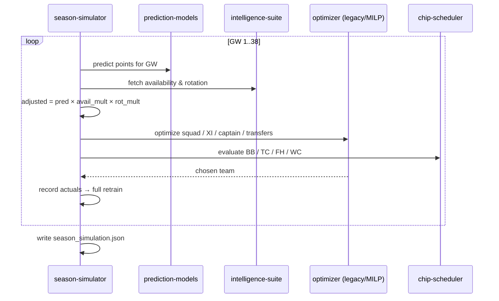

# Workflow: Season Simulation

The central end-to-end process: play a full FPL season gameweek by gameweek and
produce the result the thesis reports. This is the runtime realization of
[[system-overview]] and the per-GW loop sketched in [[data-flow]].

## Trigger
Run `pipeline/season_simulator.py` directly (typically in the Docker `fpl-sim`
image), or `POST /api/run` from the [[web-ui]]. Behavior is selected by
environment flags: `MODEL_TYPE`, `OPTIMIZER` (`legacy` | `mp`), `RULES_MODE`
(`legacy` | `corrected`), `CHIP_STRATEGY` (`v2` | `legacy`), and
`SIM_SEASON`/`SIM_END_GW`.

## Major stages

## Components involved
[[prediction-models]] (predict + retrain, via [[model-training]]),
[[intelligence-suite]] (multipliers, produced by [[intelligence-gathering]]),
[[legacy-ilp-optimizer]] **or** [[milp-optimizer]], and [[chip-scheduler]] — all
orchestrated by the [[season-simulator]].

## Inputs
Trained models (`models/xgb_*.pkl`), the raw FPL history/fixtures the simulator
reads (`data/raw/fpl_api/{player_history,players_raw,fixtures_raw}.csv`), and the
intel JSONs. Tuned constants come from [[hyperparameter-search]].

## Outputs
`data/intel/season_simulation.json` (production), or per-config variants
(`season_simulation_corrected[_mp][_<season>].json`) for redesign/cross-season
runs. Downstream, [[llm-layers]] Stage 9 and the [[web-ui]] consume it.

## Assumptions & constraints
- FPL rules: max 5 banked free transfers; transfer hits **subtracted**; one chip
  per gameweek.
- Outputs are written gameweek-by-gameweek — **never compute metrics mid-run;
  archive before reruns** ([[HANDOFF]]).

## How it can fail
- **Missing raw data** — on this clone `data/raw/` is absent, so the production
  run cannot execute without copying it in (see [[repository-map]]).
- **Environment divergence** — comparisons must stay within one environment
  (Docker); the score is env-bound (see [[environment-and-docker]]).
- **Solver infeasibility** in the [[milp-optimizer]] path (corrected rules raise
  rather than silently relax the budget).

## Related Source Files
- `pipeline/season_simulator.py`
- `pipeline/ilp_optimizer_stage8.py`, `pipeline/milp_core.py` (optimizer paths)
- `data/intel/season_simulation.json`

---
Hubs: [[system-overview]] · [[data-flow]]
